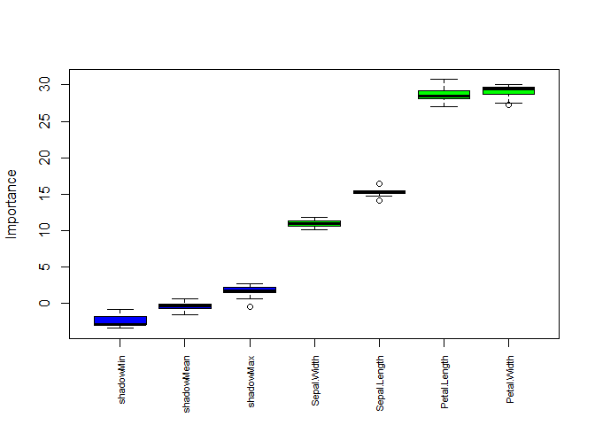
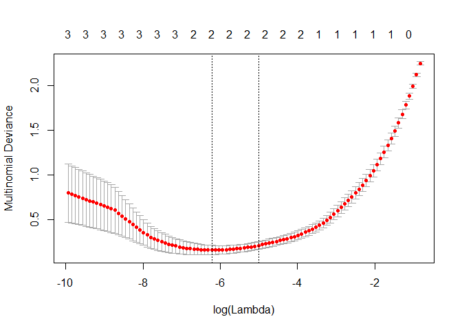
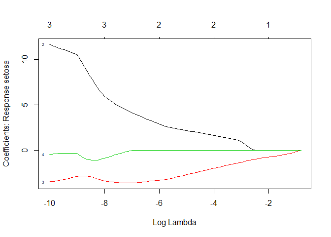
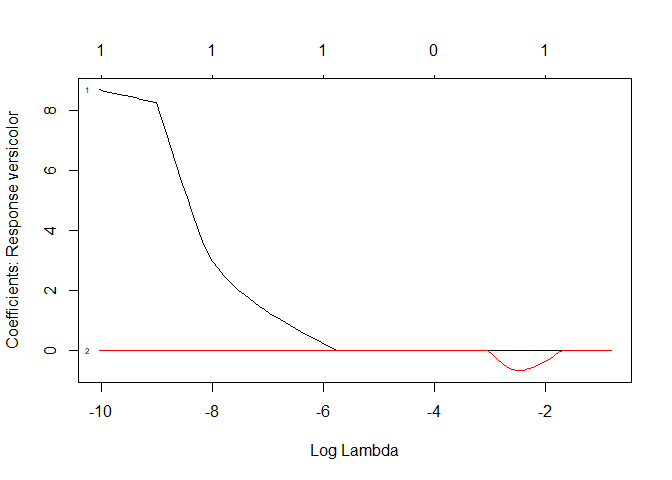
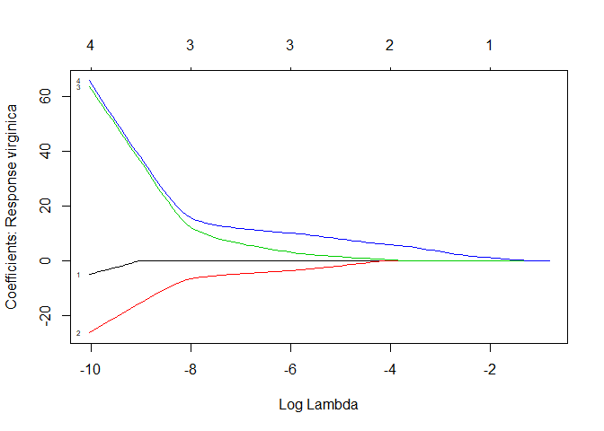
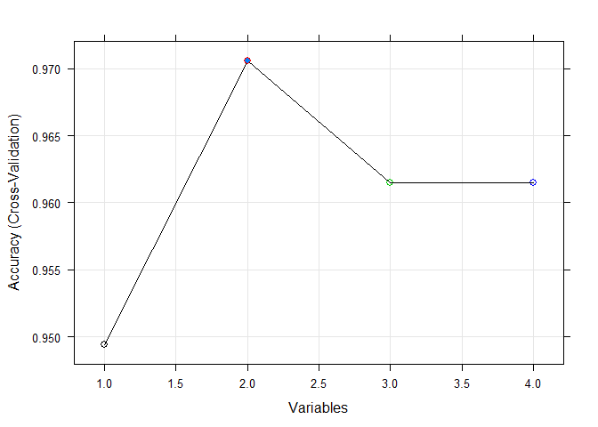

Feature Selection
================
Erika Vargas
March 9, 2019

*On this project I am going to use THREE feature selection algorithms to do the feature selection on the Iris Data Set*

1.FEATURE ELIMINATION USING BORUTA PACKAGE
------------------------------------------

#### WRAPPER METHOD

*Boruta algorithm is a wrapper method built around the random forest classification algorithm implemented in the R package randomForest. The random forest classification algorithm is relatively quick, can usually be run without tuning of parameters and it gives a numerical estimate of the feature importance. Boruta algorithm finds the importance of a feature by creating shadow features*

*Boruta can be the algorithm of choice particularly when one is interested in understanding the mechanisms related to the variable of interest, rather than just building a black box predictive model with good prediction accuracy.*

``` r
library(Boruta)
```

    ## Loading required package: ranger

``` r
data(iris)
#building training and testing dataset
data <- which(1:length(iris[,1])%%3 == 0)
iristrain <- iris[-data,]
dim(iristrain)
```

    ## [1] 100   5

``` r
iristest <- iris[data,]
dim(iristest)
```

    ## [1] 50  5

``` r
head(iristrain,10)
```

    ##    Sepal.Length Sepal.Width Petal.Length Petal.Width Species
    ## 1           5.1         3.5          1.4         0.2  setosa
    ## 2           4.9         3.0          1.4         0.2  setosa
    ## 4           4.6         3.1          1.5         0.2  setosa
    ## 5           5.0         3.6          1.4         0.2  setosa
    ## 7           4.6         3.4          1.4         0.3  setosa
    ## 8           5.0         3.4          1.5         0.2  setosa
    ## 10          4.9         3.1          1.5         0.1  setosa
    ## 11          5.4         3.7          1.5         0.2  setosa
    ## 13          4.8         3.0          1.4         0.1  setosa
    ## 14          4.3         3.0          1.1         0.1  setosa

``` r
set.seed(123)
boruta.train <- Boruta(Species~., data = iristrain, doTrace = 2)
```

    ##  1. run of importance source...

    ##  2. run of importance source...

    ##  3. run of importance source...

    ##  4. run of importance source...

    ##  5. run of importance source...

    ##  6. run of importance source...

    ##  7. run of importance source...

    ##  8. run of importance source...

    ##  9. run of importance source...

    ## After 9 iterations, +0.36 secs:

    ##  confirmed 4 attributes: Petal.Length, Petal.Width, Sepal.Length, Sepal.Width;

    ##  no more attributes left.

``` r
print(boruta.train)
```

    ## Boruta performed 9 iterations in 0.3683789 secs.
    ##  4 attributes confirmed important: Petal.Length, Petal.Width,
    ## Sepal.Length, Sepal.Width;
    ##  No attributes deemed unimportant.

``` r
#plotting the boruta method
plot(boruta.train, xlab = "", xaxt = "n")
lz<-lapply(1:ncol(boruta.train$ImpHistory),function(i)
boruta.train$ImpHistory[is.finite(boruta.train$ImpHistory[,i]),i])
names(lz) <- colnames(boruta.train$ImpHistory)
Labels <- sort(sapply(lz,median))
axis(side = 1,las=2,labels = names(Labels),
at = 1:ncol(boruta.train$ImpHistory), cex.axis = 0.7)
```



*The results using the Boruta package show that all independent variables from the iris dataset are considered important predictors for the model. We can see that even though all 4 variables are considered important, petal length and petal width are the top most important variables. That is, the characteristics of petals among iris flowers are different, therefore using this variable is going to make the predictive model more accurate. *

*Blue boxplots correspond to minimal, average and maximum Z score of a shadow attribute. Red, yellow and green boxplots represent Z scores of rejected, tentative and confirmed attributes respectively.*

*Boruta package contains a TentativeRoughFix function which can be used to fill missing decisions by simple comparison of the median attribute Z score with the median Z score of the most important shadow attribute:*

``` r
final.boruta <- TentativeRoughFix(boruta.train)
```

    ## Warning in TentativeRoughFix(boruta.train): There are no Tentative
    ## attributes! Returning original object.

``` r
print(final.boruta)
```

    ## Boruta performed 9 iterations in 0.3683789 secs.
    ##  4 attributes confirmed important: Petal.Length, Petal.Width,
    ## Sepal.Length, Sepal.Width;
    ##  No attributes deemed unimportant.

``` r
boruta.df <- attStats(final.boruta)
print(boruta.df)
```

    ##               meanImp medianImp   minImp   maxImp normHits  decision
    ## Sepal.Length 15.21174  15.16091 14.08831 16.45681        1 Confirmed
    ## Sepal.Width  10.95200  10.94542 10.11904 11.81539        1 Confirmed
    ## Petal.Length 28.61828  28.51675 27.03551 30.73579        1 Confirmed
    ## Petal.Width  29.03320  29.41019 27.21089 30.11044        1 Confirmed

*This output from the Boruta package confirms that all variables are important. Below are some of the parameters considered when running the Boruta algorithm. *

**maxRuns:** maximal number of random forest runs. You can consider increasing this parameter if tentative attributes are left. Default is 100.

**doTrace:** It refers to verbosity level. 0 means no tracing. 1 means reporting attribute decision as soon as it is cleared. 2 means all of 1 plus additionally reporting each iteration. Default is 0.

**holdHistory:** The full history of importance runs is stored if set to TRUE (Default). Gives a plot of Classifier run vs. Importance when the plotImpHistory function is called.

2. FEATURE SELECTION USING LASSO
--------------------------------

#### EMBEDDED METHOD

*This method has as great advantage the fact that it can shrink some of the coefficients to exactly zero, performing thus a selection of attributes with the regularization.* *In a linear regression, in practice for the Lasso, it means we are minimizing the RSS (Residual Sum of Squares) added to the L1 Norm.*

*Lasso and Ridge are two distinct ways of Regularization, a.k.a Shrinkage Method, which is a form of regression that constrains/regularise or shrinks the coefficient estimates towards zero. This technique discourages learning a more complex or flexible model, so as to avoid the risk of overfitting.*

*The key difference between the two techniques is that Lasso shrinks the less important feature’s coefficient to zero thus, does the job of feature selection, whilst, Ridge will never make them exactly zero. Therefore, the final model deduced via Ridge will include all predictors*

*To perform Lasso Regression in R, I will use the glmnet package, developed by the creators of the algorithm. Glmnet (Lasso and elastic-net regularized generalized linear models) is a R package that fits linear models or generalized linear model penalizing the maximum likelihood with both the LASSO method and the Ridge Regression and also the mixture of the two penalties (the elastic net). To find the minimum the glmnet algorithm uses cyclical coordinate descent.*

``` r
library(glmnet)
```

    ## Loading required package: Matrix

    ## Loading required package: foreach

    ## Loaded glmnet 2.0-16

``` r
x <- as.matrix(iristrain[,-5]) # Removes class
y <- as.matrix(iristrain[, 5]) # Only class

# Fitting the model (Lasso: Alpha = 1)
set.seed(999)
cv.lasso <- cv.glmnet(x, y, family='multinomial', alpha=1, parallel=TRUE, standardize=TRUE, type.measure='auc')

# Results
plot(cv.lasso)
```



*The plot displays the cross-validation error according to the log of lambda. The left dashed vertical line indicates that the log of the optimal value of lambda is approximately -6, which is the one that minimizes the prediction error. This lambda value will give the most accurate model.* *The numbers on top of the figure give the number of non-zero coefficients. Which means that for this example instead of using four predictors we would be using two predictors for the selected model if we would choose the one standard error estimate*

``` r
plot(cv.lasso$glmnet.fit, xvar="lambda", label=TRUE)
```



``` r
cv.lasso$lambda.min     # The exact value of lambda 
```

    ## [1] 0.001989512

``` r
cv.lasso$lambda.1se
```

    ## [1] 0.006668054

the function cv.glmnet() finds also the value of lambda that gives the simplest model but also lies within one standard error of the optimal value of lambda. This value is called lambda.1se.

``` r
coef(cv.lasso, s=cv.lasso$lambda.min)
```

    ## $setosa
    ## 5 x 1 sparse Matrix of class "dgCMatrix"
    ##                      1
    ## (Intercept)   8.546935
    ## Sepal.Length  .       
    ## Sepal.Width   3.158606
    ## Petal.Length -3.395729
    ## Petal.Width   .       
    ## 
    ## $versicolor
    ## 5 x 1 sparse Matrix of class "dgCMatrix"
    ##                     1
    ## (Intercept)  6.396964
    ## Sepal.Length 0.451785
    ## Sepal.Width  .       
    ## Petal.Length .       
    ## Petal.Width  .       
    ## 
    ## $virginica
    ## 5 x 1 sparse Matrix of class "dgCMatrix"
    ##                       1
    ## (Intercept)  -14.943899
    ## Sepal.Length   .       
    ## Sepal.Width   -3.860717
    ## Petal.Length   3.726612
    ## Petal.Width   10.430159

*for* setosa *flowers has 2 non-zero coefficients which shows that the function has chosen the two vertical lines (right and left) on the cross-validation plot*

*for* versicolor *flowers has 1 non-zero coefficients which shows that the function has chosen towards the second vertical line on the cross-validation plot (within one standard error of the minimum) because cross validation error is measured with some variance.*

*for* virginica *flowers has 3 non-zero coefficients which shows that the function has chosen towards the first vertical line on the cross-validation plot, which is the one that minimizes the prediction error. This lambda value will give the most accurate model.*

3. RECURSIVE FEATURE ELIMINATION
--------------------------------

#### WRAPPER METHOD

*A simple backwards selection, a.k.a. recursive feature elimination (RFE), algorithm. It is a greedy optimization algorithm which aims to find the best performing feature subset. It repeatedly creates models and keeps aside the best or the worst performing feature at each iteration. It constructs the next model with the left features until all the features are exhausted. It then ranks the features based on the order of their elimination.*

*RFE algorithm can be implemented using caret package.*

``` r
library(caret)
```

    ## Loading required package: lattice

    ## Loading required package: ggplot2

``` r
library(randomForest)
```

    ## randomForest 4.6-14

    ## Type rfNews() to see new features/changes/bug fixes.

    ## 
    ## Attaching package: 'randomForest'

    ## The following object is masked from 'package:ggplot2':
    ## 
    ##     margin

    ## The following object is masked from 'package:ranger':
    ## 
    ##     importance

``` r
set.seed(123)
control <- caret::rfeControl(functions=rfFuncs, method ="cv", number=10)

rfe.train <- rfe(iristrain[,1:4], iristrain[,5], sizes=1:4, rfeControl=control)
rfe.train
```

    ## 
    ## Recursive feature selection
    ## 
    ## Outer resampling method: Cross-Validated (10 fold) 
    ## 
    ## Resampling performance over subset size:
    ## 
    ##  Variables Accuracy  Kappa AccuracySD KappaSD Selected
    ##          1   0.9494 0.9241    0.05383 0.08082         
    ##          2   0.9706 0.9557    0.04787 0.07205        *
    ##          3   0.9615 0.9418    0.05023 0.07588         
    ##          4   0.9615 0.9418    0.05023 0.07588         
    ## 
    ## The top 2 variables (out of 2):
    ##    Petal.Width, Petal.Length

*The output shows that the best subset size was estimated to be 2 predictors. This set includes informative variables but did not include them all. The predictors function can be used to get a text string of variable names that were picked in the final model.* *This algorithm gives highest weightage to Petal width and petal length.*

``` r
plot(rfe.train, type=c("g","o"), cex = 1, col=1:5)
```



``` r
predictors(rfe.train)
```

    ## [1] "Petal.Width"  "Petal.Length"

``` r
rfe.train$fit
```

    ## 
    ## Call:
    ##  randomForest(x = x, y = y, importance = TRUE) 
    ##                Type of random forest: classification
    ##                      Number of trees: 500
    ## No. of variables tried at each split: 1
    ## 
    ##         OOB estimate of  error rate: 4%
    ## Confusion matrix:
    ##            setosa versicolor virginica class.error
    ## setosa         34          0         0  0.00000000
    ## versicolor      0         32         1  0.03030303
    ## virginica       0          3        30  0.09090909

*we see that recursive feature elimination algorithm has selected "Petal.Width" and "Petal.Length" as the two most important features among the 4 features in the dataset.*

4. Comparison
-------------

*Compared to the traditional feature selection algorithm (RFE), Boruta algorithm returned a much better result of variable importance which was easy to interpret. Both LASSO and RFE selected petal width and petal length as the most important predictors. I liked the output from LASSO, where I can see the importance of coefficients in correlation with each of the flower species. In general, it seems like the petal characteristics of the flowers would be a good predictor for classifying flower species. However, as seen in the Boruta output I think that using the 4 variables in this particular case makes the analysis of the iris dataset more complete. The mean square error stays below 0.1 using 4 or 2 variables. (see cv.lasso plot)*

### References

<http://ricardoscr.github.io/how-to-use-ridge-and-lasso-in-r.html> <https://www.analyticsvidhya.com/blog/2016/03/select-important-variables-boruta-package/> <https://beta.vu.nl/nl/Images/werkstuk-fonti_tcm235-836234.pdf> <http://dataaspirant.com/2018/01/15/feature-selection-techniques-r/> <https://www.cs.cmu.edu/~kdeng/thesis/feature.pdf> <https://gerardnico.com/lang/r/ridge_lasso#ridge> <http://www.sthda.com/english/articles/36-classification-methods-essentials/149-penalized-logistic-regression-essentials-in-r-ridge-lasso-and-elastic-net/>
